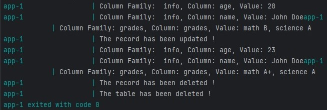

Using the Java API to Manage HBase:
Explore a robust Java API in this repository designed for seamless interaction with HBase, a distributed NoSQL database. Simplify your HBase tasks and enhance development efficiency with this user-friendly Java library.

### Summary:
Included in this repository are essential components for your setup:

- Dockerfile
- docker-compose.yml
- App.java: Equipped with functions for:
   - Table creation
   - Data insertion
   - Table updates
   - Data deletion

### Running the Application:
Follow these steps to execute the application successfully:

1. Install necessary packages.
2. Build Docker images: Execute `docker-compose build`.
3. Launch containers: Run `docker-compose up`.

### Outcome:
Experience a sample output showcasing the seamless integration of Java and HBase.

